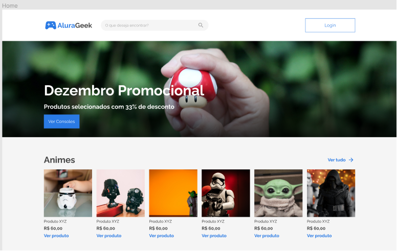

## Um projeto baseado em um figma da alura, mas com algumas modificações.

Primeiramente será um projeto de uma loja contendo produtos e artigos fictícios, nada real. Poren tentarei fazer toda a parte full  stack dela com ReactJs

  Ao longo do tempo estarei tentando sempre atualizar para ficar pronto em alguns meses, a parte de back-end demorara para funcionar corretamente, pois não tenho conhecimento nenhum
  Projeto apenas para treinar o front end e quem sabe aprender back end na prática.

